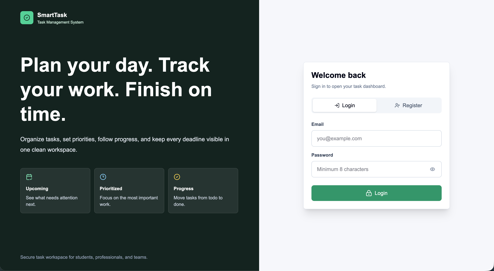
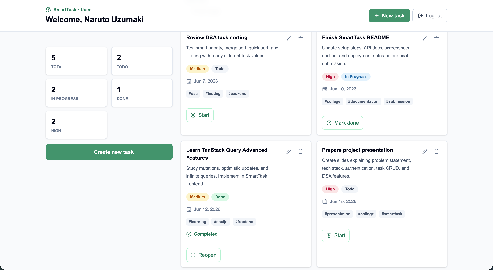
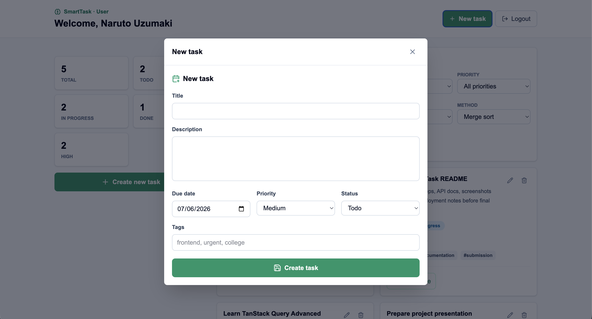
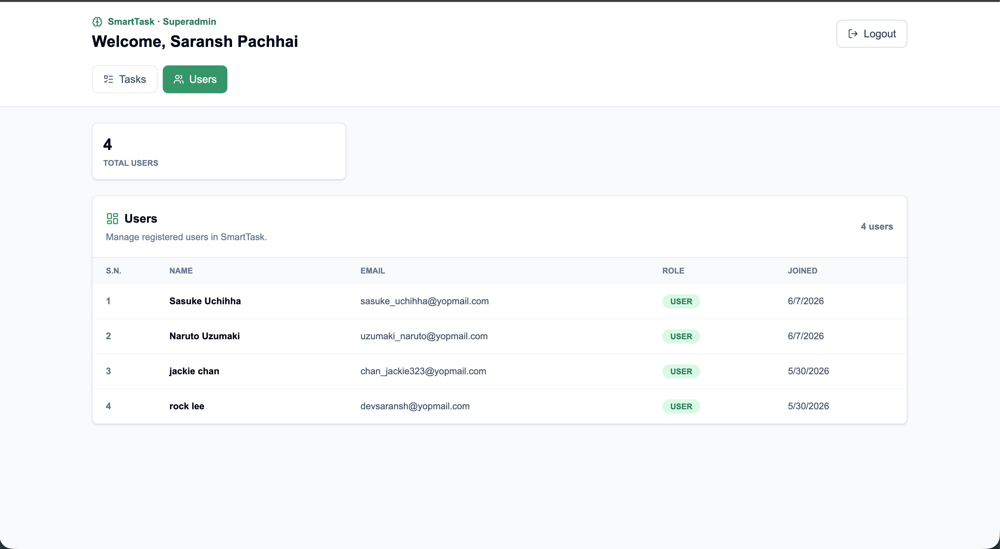
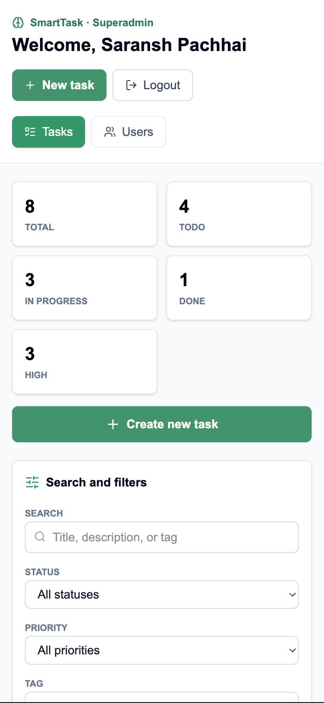

# SmartTask: Advanced Task Management System


SmartTask is a full-stack, production-style task management system built with Next.js, Express, MongoDB, JWT authentication, role-based access control, and DSA-powered task intelligence.

## Features

- JWT authentication with httpOnly cookies
- Register, login, logout, and session restore
- User and superadmin roles
- API rate limiting for general traffic and stricter auth protection
- Startup superadmin seeding from environment variables
- Full task CRUD over REST APIs
- Task fields: title, description, due date, priority, status, and tags
- Smart prioritization by due date and priority
- Search, status filters, priority filters, tag filters, and dynamic sorting
- Pagination for task lists and admin user lists
- Superadmin statistics using MongoDB aggregation
- Responsive Next.js dashboard with loading states, validation, and toast notifications

## DSA Highlights

- Priority Queue using a binary heap for smart task ordering
- Merge Sort and Quick Sort for dynamic sorting
- Binary Search for exact title lookup after sorted indexing
- Hash Maps for efficient status, priority, and tag filtering
- Arrays and Sets for pagination, deduplication, and result intersection

## Project Structure

```bash
smarttask/
├── client/   # Next.js 16 + React 19 + TypeScript + Tailwind CSS v4
├── server/   # Node.js + Express + TypeScript + MongoDB + DSA modules
├── screenshots/   # README screenshots
└── README.md
```

## Setup

Prerequisites:

- Node.js 22 or newer
- pnpm 10 or newer
- MongoDB running locally or a MongoDB Atlas connection string

Clone the repository:

```bash
git clone git@github.com:saransh619/smarttask.git
cd smarttask
```

Install dependencies separately because the root is intentionally kept clean:

```bash
cd client
pnpm install
cd ..
```

```bash
cd server
pnpm install
cd ..
```

Create environment files from the examples:

```bash
cp client/.env.example client/.env
cp server/.env.example server/.env
```

Update `client/.env` and `server/.env` with your local values, then run both apps in separate terminals:

```bash
cd server
pnpm dev
```

```bash
cd client
pnpm dev
```

Client runs on `http://localhost:3000`.
Server runs on `http://localhost:5000`.

## Environment Variables

Create `client/.env`:

```bash
NEXT_PUBLIC_API_URL=http://localhost:5000/api
```

Create `server/.env`:

```bash
NODE_ENV=development
PORT=5000
CLIENT_URL=http://localhost:3000
MONGODB_URI=mongodb://127.0.0.1:27017/smarttask
JWT_SECRET=replace-with-a-long-random-secret
JWT_EXPIRES_IN=7d
SUPER_ADMIN_NAME=SmartTask Superadmin
SUPER_ADMIN_EMAIL=admin@smarttask.com
SUPER_ADMIN_PASSWORD=change-this-password
```

If the superadmin env values are present, the backend checks at startup whether a superadmin already exists. If not, it seeds one automatically.

Default local superadmin credentials from the example above:

```bash
Email: admin@smarttask.com
Password: change-this-password
```

Change the password before deployment.

## API Documentation

Base URL: `http://localhost:5000/api`

All API responses use one consistent envelope:

```json
{
  "success": true,
  "statusCode": 200,
  "message": "Request completed successfully",
  "data": {}
}
```

### Auth

| Method | Endpoint | Description |
| --- | --- | --- |
| POST | `/auth/register` | Create account and set auth cookie |
| POST | `/auth/login` | Login and set auth cookie |
| GET | `/auth/session` | Public session check for restoring logged-in users |
| GET | `/auth/me` | Get current authenticated user |
| POST | `/auth/logout` | Clear auth cookie |

Auth endpoints use a stricter rate limiter to slow down repeated failed login/register attempts.

### Tasks

| Method | Endpoint | Description |
| --- | --- | --- |
| GET | `/tasks` | List tasks with filters and DSA sorting |
| POST | `/tasks` | Create task |
| GET | `/tasks/:id` | Get one task |
| PATCH | `/tasks/:id` | Update task |
| DELETE | `/tasks/:id` | Delete task |

Supported task query params:

```bash
search=report
status=Todo
priority=High
tag=college
sortBy=smart|dueDate|priority|status|title|createdAt
sortOrder=asc|desc
algorithm=merge|quick
page=1
limit=10
```

### Admin

Admin routes require a logged-in user with role `superadmin`.

| Method | Endpoint | Description |
| --- | --- | --- |
| GET | `/admin/stats` | Aggregated app statistics |
| GET | `/admin/users` | List registered users |

Supported admin user query params:

```bash
page=1
limit=10
```

## Security Notes

- httpOnly JWT cookies are used so tokens are not stored in browser JavaScript state.
- Helmet adds common secure HTTP headers.
- CORS is restricted with credentials enabled for the configured frontend URL.
- `/api` routes use a general rate limiter.
- `/auth/login` and `/auth/register` use a stricter rate limiter for brute-force protection.
- `/auth/session` is marked `no-store` to avoid cached session state.

## Scripts

Run these from inside `client/`:

```bash
pnpm dev
pnpm build
pnpm start
pnpm typecheck
```

Run these from inside `server/`:

```bash
pnpm dev
pnpm build
pnpm start
pnpm typecheck
```

## Screenshots

### Authentication



### Task Dashboard



### New Task Modal



### Admin Users



### Mobile View



## Deployment

Recommended production setup:

- Deploy `client/` to Vercel.
- Deploy `server/` to Render, Railway, Fly.io, or a VPS.
- Use MongoDB Atlas for the database.
- Set `CLIENT_URL` to the deployed frontend URL from Vercel.
- Set `NEXT_PUBLIC_API_URL` to the deployed backend `/api` URL.
- Use a long random `JWT_SECRET`.

Render backend settings:

```bash
Root Directory: server
Build Command: pnpm install --frozen-lockfile && pnpm build
Start Command: pnpm start
```

Render backend environment variables:

```bash
NODE_ENV=production
CLIENT_URL=https://your-frontend-domain.vercel.app
MONGODB_URI=your-mongodb-atlas-uri
JWT_SECRET=your-long-random-secret
JWT_EXPIRES_IN=7d
SUPER_ADMIN_NAME=SmartTask Superadmin
SUPER_ADMIN_EMAIL=admin@example.com
SUPER_ADMIN_PASSWORD=your-strong-password
```
